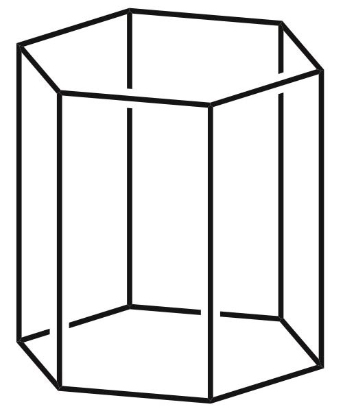

```
bounding volume | accepts | seconds
------------------------------------------
           AABB |   29355 |  8.3969
       HexPrism |   28622 |  6.9214
```       

Coordinate Space
----------------

For the purposes of this paper, XY define the horizontal plane, and positive Z points upwards at the sky.

Hex Prism Bounding Volume
-------------------------------

The [Axis-Aligned Bounding Octahedron (AABO)](http://www.github.com/bryanmcnett/aabo) is better than AABB for objects
distributed fairly throughout 3D space, but most videogames have a distribution of objects that is fair in XY but not 
in Z. For games that are strictly 2D, axis-aligned bounding hexagons are best, but most 3D games take place on some 
kind of almost-2D terrain with mild verticality in Z. For this majority of games, a different data structure is a better 
fit than AABB or AABO.

Hex Prism
---------

We are talking here specifically about hexagonal prisms aligned to the Z axis, like the houses in this image.


This sort of bounding volume can be as tall and skinny as you like in Z, and also in three directions in the XY 
plane, for a total of four long-and-skinny directions, which is more than the three of an AABB.

Whatever shape is well-bounded by an AABB, is better-bounded by a hex prism, which can even *be* an AABB if you
set two of its axes to X and Y. Despite the fact that a hex prism has 33% more planes, an AABB spends 33% more 
energy in trivial rejection, because a hex prism almost always rejects after reading three values from memory, 
instead of an AABB's four.



Like AABO, a hex prism has eight sides. Unlike AABO, it is not made of opposing tetrahedra. Instead, it is made of 
opposing triangular prisms whose caps are coplanar in the XY plane. Each has five sides, but we do not store a total
of ten sides, because the triangular prisms share caps. Unlike with tetrahedra, it is not efficient to test 
opposing pairs of triangular prisms in turn, because the caps would be tested more than once.

There are two better ways to look at the hex prism:

1. It is an axis-aligned bounding hexagon in XY, plus an unrelated interval in Z. This leads to the most efficient
implementation, as a hexagon-hexagon check is most likely to exclude the vastest majority of objects in a mostly-2D world.
However, the three values of a triangle don't pack well into SIMD registers unless you write intrinsics.

2. A. a triangular prism that ascends from the earth to some specific point in Z, matched to B. an opposing triangular
prism that descends from the sky to some specific point in Z. These are not closed shapes, but A can play the role of
terrain and B can play the role of a thing that rests on the terrain. As each of these things has four values - three
for the triangle and one for Z - it fits nicely into SIMD registers and cache, even when intrinsics aren't used.
However, efficiency is lost when Z values are mixed with XY in memory.

The Naive Implementation
------------------------

This implementation is fairly easy to auto-vectorize or represent with naive SIMD (a "float4 class")

```
struct UpTriangularPrism
{
  float minA, minB, minC, minZ;
};

struct DownTriangularPrism
{
  float maxA, maxB, maxC, maxZ;
};

bool Intersects(UpTriangularPrism u, DownTriangularPrism d)
{
  return u.minA <= d.maxA
      && u.minB <= d.maxB
      && u.minC <= d.maxC
      && u.minZ <= d.maxZ;
}
```

The intersection of an UpPrism and DownPrism is a HexagonalPrism:

```
struct HexagonalPrisms
{
  UpTriangularPrism   *up;   // Triangular prism points up in Y, extends from specific Z to positive infinity
  DownTriangularPrism *down; // Triangular prism points down in Y, extends from specific Z to negative infinity
};

bool Intersects(HexagonalPrisms world, int index, HexagonalPrism query)
{
  return Intersects(query.up, world.down[index])  // query comes down from sky, world comes up to meet it
      && Intersects(world.up[index], query.down); // world comes down from sky, query comes up to meet it
}
```


The novel bit here is in the order of the tests in the Intersection function. Let's look at it closely:

```
bool Intersects(HexagonalPrisms world, int index, HexagonalPrism query)
{
  return Intersects(query.up, world.down[index])  // query comes down from sky, world comes up to meet it
      && Intersects(world.up[index], query.down); // world comes down from sky, query comes up to meet it
}
```

The first test approximates the world object as a triangular prism that extends from some point underfoot,
downwards to infinity. This describes terrain features well. Most of the time, terrain is assumed
to extend downwards to infinity, in concept. The query object is approximated as a triangular prism that
extends from infinitely high in the sky, downwards to its "feet." It's quite unlikely that there is anything
in the sky above a player at any given moment in time, so this is also a good match.

Therefore, in the case that a world object is far enough away in XY for the up and down XY triangles to not
intersect, we pay for only four checks instead of an AABB's six. And, in the case where a world object *is*
close enough to intersect in XY, we still pay for only four checks, as long as the query is above the terrain:
flying or jumping or falling or ragdolling, or simply above it for some other reason.

Only when the object is close to the query in XY, *and* when the query's "feet" are below the top of the 
object, do we pay for eight checks.

The cost is therefore roughly the same as the XY of an AABB - four comparisons. But there are six planes perpendicular
to XY, which is a tighter fit than an AABB's four planes, for when the query and world object are close enough in
XY to merit it. 

And, intersection tests between airborne objects and terrain can fail without consulting any more than the same four
comparisons.


A More Efficient Implementation
-------------------------------

Up to now, we have been able to introduce new bounding volumes using the conventional notation of the C struct
containing floats, and see performance pretty close to what the geometry indicates, plus pretty good autovectorization
on contemporary processors. But to get the most efficiency from Hexagonal Prisms, we can no longer do this.

This is because a triangle has three values, which is a poor match for naive SIMD.

The more efficient implementation of Hexagonal Prisms uses SIMD intrinsics, and looks more like this:

```
struct UpTriangle
{
  floatN minA, minB, minC;
};

struct DownTriangle
{
  floatN maxA, maxB, maxC;
};

struct ZInterval
{
  floatN minZ, maxZ;
};

struct HexagonalPrism
{
  UpTriangle up;
  DownTriangle down;
  ZInterval z;
};

struct HexagonalPrisms
{
  UpTriangle *up;
  DownTriangle *down;
  ZInterval *z;
};

int Intersects(UpTriangle up, DownTriangle down)
{
  return less_equals(up.minA, down.maxA)
       & less_equals(up.minB, down.maxB)
       & less_equals(up.minC, down.maxC);
}

int Intersects(HexagonalPrisms world, int index, HexagonalPrism query)
{
  int mask = 0;
  if(mask = Intersects(query.up, world.down[index])) // query up triangle intersects world down triangle
  {
    mask &= Intersects(world.up[index], query.down))        // world up triangle intersects query down triangle
    mask &= less_equals(query.z.minZ, world.z[index].maxZ)) // query's bottom intersects world's top
    mask &= less_equals(world.z[index].minZ, query.z.maxZ)) // world's bottom intersects query's top
  }  
  return mask;
}
```

This is more efficient because it reads only three values into memory for the vast majority of objects: maxA, maxB, and
maxC. The remaining five values are read only in the unlikely event that the initial triangle check passes.

We could attempt to never read Z into memory, unless the initial hexagon check passes. But making decisions (branching)
itself consumes energy, and the first decision we made - the decision to reject objects or investigate further, based on 
the results of a triangle test - has a much higher payoff than any subsequent decision can.

If you know your query has a far smaller DownTriangle than an UpTriangle (if, for example, it is roughly
DownTriangle-shaped) you can reverse the initial triangle test like so, to get better initial culling:

```
int Intersects(HexagonalPrisms world, int index, HexagonalPrism query)
{
  int mask = 0;
  if(mask = Intersects(world.up[index], query.down)) // world up triangle intersects query down triangle
  {
    mask &= Intersects(query.up, world.down[index]))        // query up triangle intersects world down triangle
    mask &= less_equals(query.z.minZ, world.z[index].maxZ)) // query's bottom intersects world's top
    mask &= less_equals(world.z[index].minZ, query.z.maxZ)) // world's bottom intersects query's top
  }  
  return mask;
}
```

The Pragmatic Axes
------------------

As with [Axis-Aligned Bounding Octahedron (AABO)](http://www.github.com/bryanmcnett/aabo) it is possible to use the
elegant axes ABC that point at the vertices of an equilateral triangle, or the pragmatic axes {A,B,C} = {X, Y, -(X+Y)}.

If you use these pragmatic axes, you can convert a pre-existing AABB into a Hexagonal Prism with exactly the same
box shape it always had, and which needs to compare only 5 values per hexagon, instead of 6:

```
UpTriangle   up   = {minX, minY, -(maxX+maxY)}
DownTriangle down = {maxX, maxY, -(minX+minY)}
```

You still have the benefit of needing to read only 3 values from memory per object most of the time, which is
nicer than an AABB's 4. This is reminiscent of the [7-Sided AABB](http://www.github.com/bryanmcnett/aabo) and I guess 
you could call it a 5-Sided AABB. 
